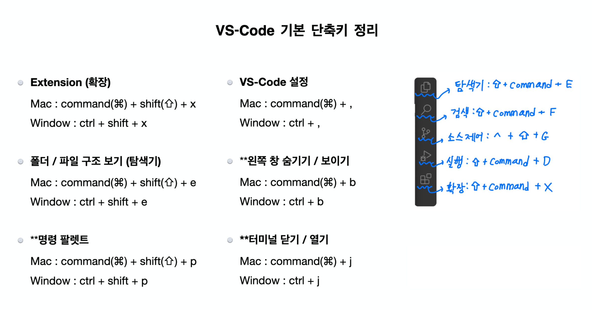

## VSCode

 
 

## 참고 자료

-   [http 프로토콜 자료 링크 1](https://developer.mozilla.org/ko/docs/Web/HTTP)
-   [http 프로토콜 자료 링크 2](https://web.dev/performance-http2/)

-   [Rest API 공식문서 링크](https://learn.microsoft.com/ko-kr/azure/architecture/best-practices/api-design)

-   [JSON 과 JavaScript 차이](https://developer.mozilla.org/ko/docs/Web/JavaScript/Reference/Global_Objects/JSON)
